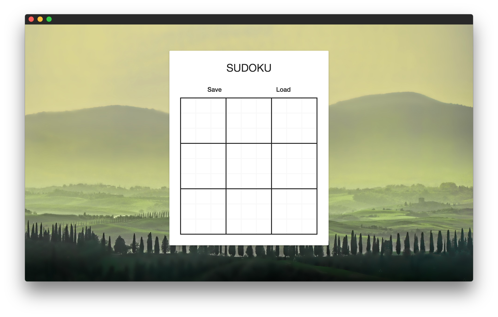

# Sudoku
##  SAT Sudoku solver

Sudoku-solver implemented with SAT. Runs with Electron.



## Install

```
brew install tesseract --with-all-languages
npm install
```

## Build

```
npm run electron
```

## Create distributable

```
npm run dist
```